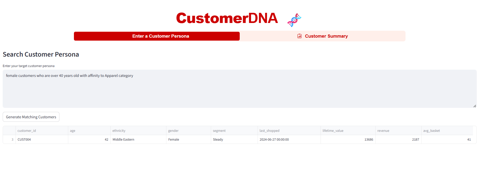
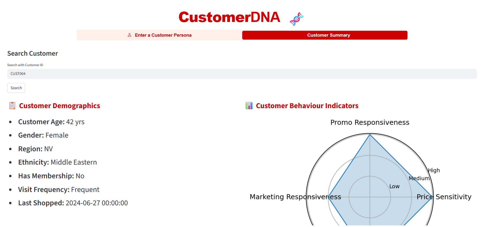
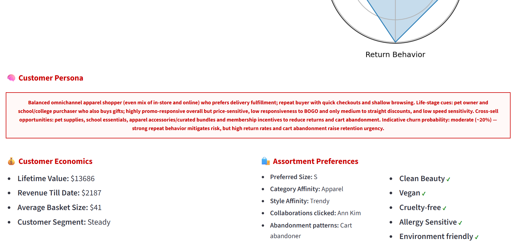

# CustomerDNA 🧬 — GenAI-Powered Persona Search & Customer Insights (Streamlit)

CustomerDNA turns natural-language personas into deterministic data filters and crisp customer insights. Business users type prompts like “female customers over 40 with affinity to Apparel”; the app returns the exact rows i.e. relevant customers. The app has another tab called "Customer Summary" which takes in a Customer ID as user input and displays all the details about that Customer including a AI powered summary about their persona and customer behaviour.

## What This Solves:

1. Fast audience discovery without SQL or dashboard clicks
2. Deterministic, auditable results (LLM proposes filters; pandas enforces logic)
3. Works across many columns; schema is inferred from the dataset

## App Screenshots:

Persona search (Female, >40, Apparel):

Customer Profile:

## How It Works (Architecture)

                ┌───────────────────────────┐
                │  CSV/Excel Dataset        │
                └─────────────┬─────────────┘
                              │  load + normalize (cache)
                              ▼
                     ┌───────────────┐
                     │ Schema Builder│  ← col names, types, samples
                     └───────┬───────┘
                             │  persona text
                             ▼
                 ┌─────────────────────────┐
                 │ LLM (OpenAI Responses)  │ ───────────┬─────────────────► Persona summary for a single Customer ID  (LLM text generation)
                 │ Persona → JSON filter   │
                 └───────────┬─────────────┘
                             │  normalize/validate
                             ▼
                    ┌─────────────────┐
                    │  Pandas Engine  │  ← strict evaluator (AND/OR/NOT, ops)
                    └───┬─────────────┘
                        │         
                        │         
                        ▼
                ┌──────────────────────┐
                │ Streamlit UI         │
                │ Tables, Radar chart  │
                └──────────────────────┘

## Why it’s different:

1. Deterministic, auditable results. The model never selects rows; it only proposes filters. Your code enforces logic and equality.

2. Scales to many columns. The schema is derived from the dataset—no hard-coded field mapping.

3. Secure by design. The full dataset stays local; only a minimal schema and the persona are sent to the model.

4. Production-minded. Caching, defensive parsing, normalized columns, and modular functions make it easy to extend.

## Tech stack:

Streamlit, pandas, numpy, matplotlib
OpenAI Python SDK (Responses API)

## Use cases:

1) Audience discovery for marketing or CRM

2) Fast customer segmentation experiments

3) Analyst-friendly prototype for data apps that blend LLMs with strict governance

## Code flow (deep dive)
1) Load & normalize data

2) Build schema for the LLM

  To scale to any column, the app infers a schema with (name, type, sample values).
  This keeps the prompt small and avoids leaking the full dataset.

3) Persona → JSON filter (LLM)
   
Tables make the model “choose rows,” which is non-deterministic. JSON filter specs are small, auditable, and applied locally.

4) Normalize spec

Models sometimes return slight variants (e.g., {"and":[...]}). normalize_filter_spec coerces every variant into the canonical shape. Also normalizes operator synonyms ("equals" → "=", "gte" → ">="), and supports nested boolean groups (and, or, not).

5) Apply spec in pandas

The evaluator supports numeric, string, and date operators; unknown columns become False (fail-closed).

6) Display
   
Depending on the tab, the final display is either list of customers matching the entered search persona or customer profile based on entered Customer ID.

## Quickstart:

1) Create & activate a venv (optional)
python -m venv .venv

 Windows:
.venv\Scripts\activate
macOS/Linux:
source .venv/bin/activate

2) Install deps
pip install -U streamlit pandas numpy openpyxl matplotlib streamlit-option-menu openai

3) Configure env (either one)
    A) Streamlit secrets (recommended)
       .streamlit/secrets.toml
       OPENAI_API_KEY="sk-..."
    B) Environment variable
       setx OPENAI_API_KEY "sk-..."    # Windows
       export OPENAI_API_KEY="sk-..."  # macOS/Linux

 4) Put your dataset (Excel) somewhere and set DATA_PATH in the code or via env
    DATA_PATH="C:/path/to/GuestDNA_Sample_data1.xlsx"

 5) Run the app
streamlit run customerDNA.py

## Configuration:

1. OpenAI: Requires an API key. Uses the Responses API (openai Python SDK ≥ v1).

2. Dataset path: Edit DATA_PATH in code or read from an env var.

## Extending the app:

1. More operators: add regex or levenshtein in eval_condition.

2. Synonym maps: canonicalize values (e.g., “often” → “Frequent”).

3. Multi-file split: move schema/evaluator/UI into modules.

4. DB backend: swap dataframe for SQL

5. Auth & sharing: add login and user workspaces.

### Contributions and stars welcome!
